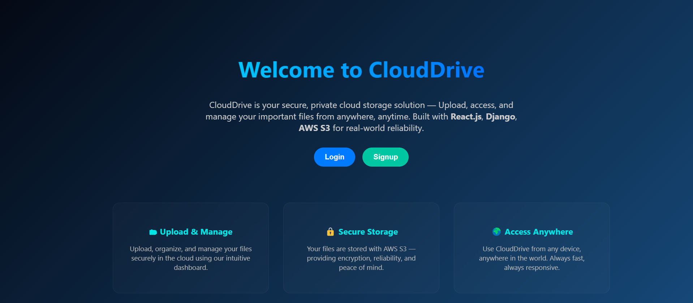
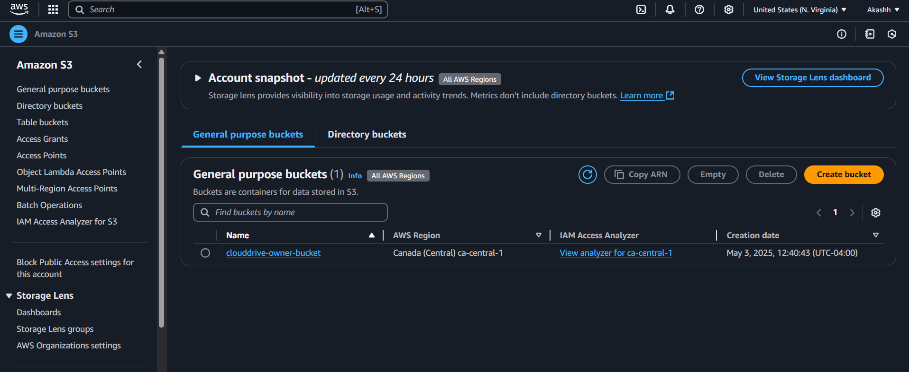
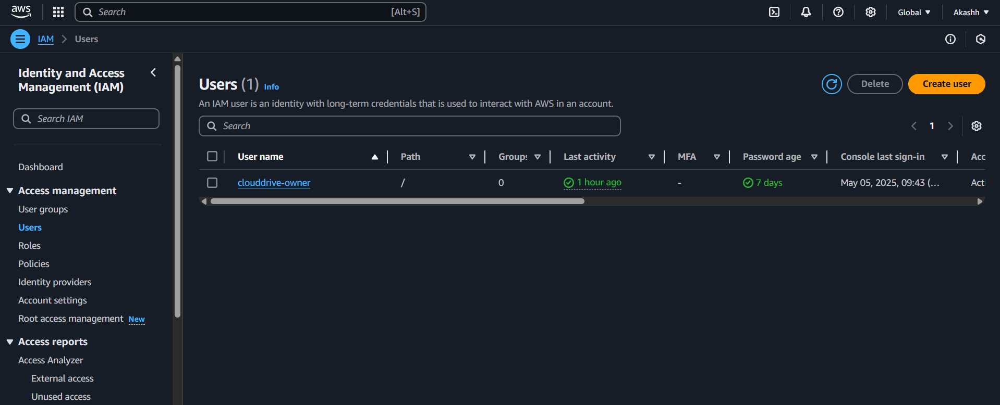

# ☁️ CloudDrive – Personal Cloud Storage Web App

CloudDrive is a full-stack cloud storage solution that allows users to securely **upload**, **store**, **access**, and **manage files** in the cloud — from anywhere, on any device. Built with performance, simplicity, and user experience in mind, CloudDrive mimics essential features of services like Google Drive or Dropbox.

### 🔐 Landing Page

### 🔐 Login Page

### 🔐 Signup Page

### 🔐 Upload Page

### 🔐 AWS S3
 
### 🔐 AWS EC2

### 🔐 AWS IAM


---

## 🔍 Overview

CloudDrive enables users to:

- Upload and organize personal files
- Preview or download documents/images
- Perform CRUD operations (rename, delete, move files)
- View storage usage
- (Optional) Share files with others via generated links

---

## 🚀 Features

- 🧑‍💼 **User Authentication**
  - Secure login/signup system with email-password (or OAuth)
  - Firebase Auth or JWT-based sessions

- 📤 **File Uploads**
  - Upload documents, images, or any file type with progress indication
  - Drag-and-drop or click-to-select interface

- 🗂️ **File Management**
  - Rename, delete, move, or organize files into folders
  - Real-time updates using Firestore/Realtime DB or local state

- 🧭 **Dashboard**
  - Displays uploaded files, recent activity, and storage usage

- 🔗 **File Sharing (optional)**
  - Generate public links with expiration options
  - Restrict access based on permissions

---

## 🛠️ Tech Stack

| Layer        | Tools & Technologies                       |
|--------------|---------------------------------------------|
| Frontend     | React.js, Tailwind CSS, HTML5, JavaScript   |
| Backend      | Node.js, Express (or Firebase Functions)    |
| Auth         | Firebase Auth / JWT                        |
| Storage      | Firebase Storage / AWS S3 / Cloudinary      |
| Database     | Firebase Realtime DB / Firestore / MongoDB  |
| Deployment   | Vercel, Netlify, Firebase Hosting           |

---

## 📂 Folder Structure

```bash
clouddrive/
├── public/
├── src/
│   ├── components/
│   │   ├── UploadButton.jsx
│   │   ├── FileItem.jsx
│   │   ├── Dashboard.jsx
│   ├── pages/
│   │   ├── Home.jsx
│   │   ├── Login.jsx
│   │   ├── Register.jsx
│   ├── services/
│   │   ├── firebase.js
│   │   ├── storage.js
│   ├── App.js
│   ├── index.js
├── .env
├── firebaseConfig.js
├── package.json
└── README.md

